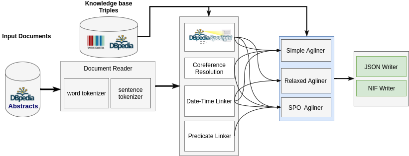

# T-Rex : A Large Scale Alignment of Natural Language with Knowledge Base Triples

Paper Under Submission.

## Introduction

Several datasets with alignments between knowledge base triples and free text have been built, for several independent tasks, such as Relation Extraction, Knowledge base population, Relation Discovery...

But where the others datasets have a small number of documents (*TAC-KBP*), only have the relations without the original documents (*FB15K-237*), have a little amount of relations (*Google-RE*), we present a dataset containing large-scale high-quality alignments between DBpedia abstracts and Wikidata triples, **_T-REx_**.

## Size

With 11 million triple alignments made from 3.09 million DBpedia abstracts (6.2 million sentences), **_T-REx_** is two orders of magnitude larger than the largest available alignments to the community.

| Dataset                  | Documents / Format      | Unique predicates | Aligned Triples | Availability           |
|:------------------------:|:-----------------------:|:-----------------:|:---------------:|:----------------------:|
| NYT-FB (yao et al. 2011) | 1.8M Sent.              | 258               | 39K             | partially available    |
| TAC KBP                  | 90K Sent.               | 41                | 122K            | closed                 |
| FB15K-237                | 2.7 M textual-relations | 237               | 2.7M            | publicly available     |
| Wikireadings             | 4.7M Articles           | 884               | n.a.            | publicly available     |
| Google-RE                | 60K Sent.               | 5                 | 60K             | publicly available     |
| **T-REx**                | **6.2M Sent.**          | **642**           | **11M**         | **publicly available** |

## How is it built ?
We use a set of components to read documents, entity linking and extract triples.
For the triples, we have three methodologies that all rely on the distant supervision assumption.
* The Nosubject aligner :
Assumes that sentences in the same paragraph have the same subject.
* The AllEnt aligner :
Take every pair of entities in the sentence and find matches in the knowledge base relations.
(Use also coreference resolution to solve the implicit mention of entities by finding all mentions of the main entity in the other paragraphs.)
* The SPO aligner :
Aligns triples only when the subject, the object **and** the predicate are found in the sentence (the predicate is extracted using a property linker)

      

## Evaluation
We derive a crowdsourcing experiment to evaluate the quality of our generated dataset.
We asked contributors to read the document and annotate each triple to be true only if the triple is explicitly mentioned in the given document.
To guarantee high quality annotations we manually annotated 100 documents and used them to filter out the bad contributors.

## Accessibility
Our dataset is available in [JSON format](./samples/sample-output.json) and can also be provided as a [NIF output](./samples/sample-output-Nif.ttl)

The full dump will be available after paper's acceptance.

## Contributors
[Hady Elsahar](hady.elsahar@univ-st-etienne.fr)

[Pavlos Vougiouklis](pv1e13@ecs.soton.ac.uk)

[Arslen Remaci](arslen.remaci@etu.univ-st-etienne.fr)

## Acknowledgements
      

 

WDAqua project is funded by the European Union‘s Horizon 2020 research and innovation programme under the Marie Skłodowska-Curie grant agreement No 642795.
